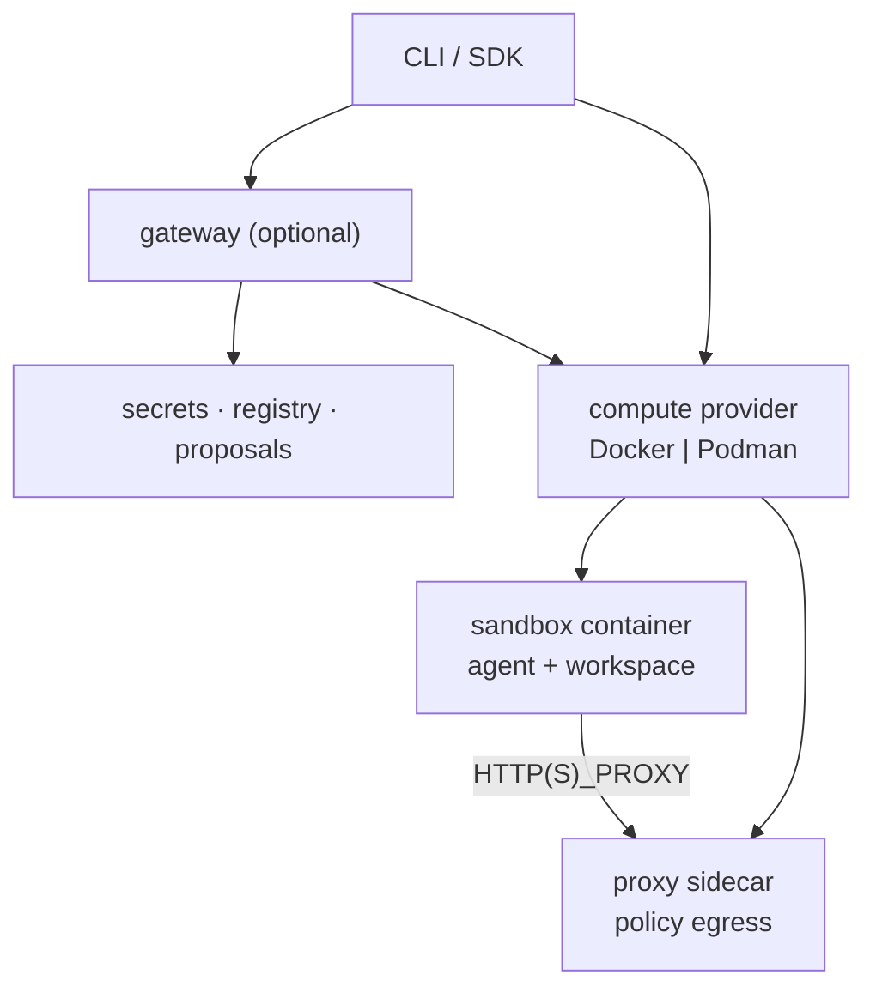

<!--
SPDX-FileCopyrightText: Copyright (c) 2026 cautem
SPDX-License-Identifier: Apache-2.0
-->

# Architecture

## Planes

| Plane | Components |
|-------|------------|
| Control | CLI, gateway HTTP API, encrypted secrets, proposals |
| Data | Sandbox container, workspace bind, agent process |
| Enforcement | Proxy sidecar, Landlock/seccomp via `cautem-init` |

## Create path

Docker and Podman share the split Moby client/API SDK and require a compatible
Engine API version of at least 1.40. The client negotiates the API version
automatically. Updating SDK dependencies covers the client code; update the
Docker or Podman daemon separately.

1. CLI resolves image, policy, providers, soft defaults.
2. Driver ensures Engine images (sandbox + slim proxy).
3. Driver creates internal network, proxy, sandbox, volumes.
4. Gateway registers the sandbox when configured.
5. Guest traffic uses `HTTP(S)_PROXY` toward the sidecar.

## Modules

| Module | Role |
|--------|------|
| `cautem-cli` | User CLI |
| `cautem-core` | Policy schema + engine |
| `cautem-driver` | Docker / Podman / stubs |
| `cautem-proxy` | Egress sidecar + `policy.local` |
| `cautem-gateway` | Control plane |
| `cautem-runtime` | Init, images, agent helpers |
| `cautem-providers` | Credential profiles |
