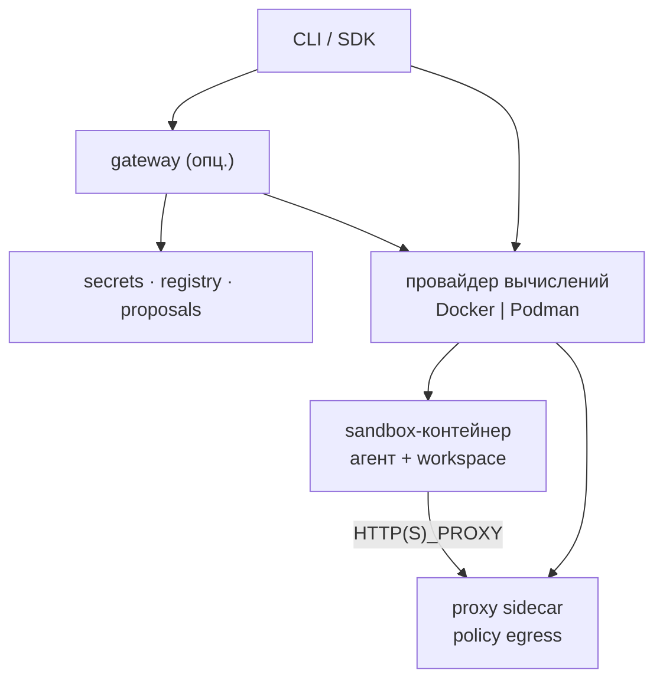

<!--
SPDX-FileCopyrightText: Copyright (c) 2026 cauteum
SPDX-License-Identifier: Apache-2.0
-->

# Архитектура

## Плоскости

| Плоскость | Компоненты |
|-----------|------------|
| Control | CLI, HTTP API gateway, encrypted secrets, proposals |
| Data | Sandbox-контейнер, bind workspace, процесс агента |
| Enforcement | Proxy sidecar, Landlock/seccomp через `cauteum-init` |

## Путь create

Docker и Podman используют отдельные Moby client/API SDK modules и требуют
совместимый Engine API версии не ниже 1.40. Клиент автоматически согласует
версию API. Обновление SDK dependencies касается клиентского кода; daemon
Docker или Podman обновляется отдельно.

1. CLI резолвит образ, policy, providers, soft defaults.
2. Driver обеспечивает образы Engine (sandbox + slim proxy).
3. Driver создаёт internal network, proxy, sandbox, volumes.
4. Gateway регистрирует sandbox при наличии.
5. Guest ходит через `HTTP(S)_PROXY` на sidecar.

## Модули

| Модуль | Роль |
|--------|------|
| `cauteum-cli` | Пользовательский CLI |
| `cauteum-core` | Схема policy + engine |
| `cauteum-driver` | Docker / Podman / stubs |
| `cauteum-proxy` | Egress sidecar + `policy.local` |
| `cauteum-gateway` | Control plane |
| `cauteum-runtime` | Init, образы, helpers агента |
| `cauteum-providers` | Credential-профили |
