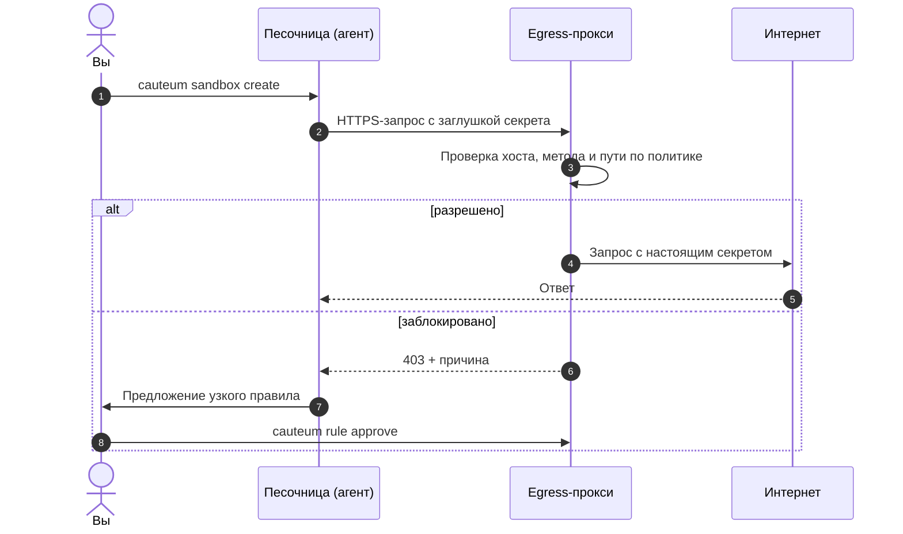

<!--
SPDX-FileCopyrightText: Copyright (c) 2026 cauteum
SPDX-License-Identifier: Apache-2.0
-->

## Зачем

Coding-агенты запускают команды, ставят пакеты и ходят в API за вас. Если
запускать их прямо на машине, им доступны весь домашний каталог, SSH-ключи,
облачные доступы и открытый интернет. Одного неудачного промпта или
заражённого пакета хватит, чтобы что-то утекло или сломалось.

cauteum запускает агента в контейнере с ограниченным доступом к файлам и
**сетевым доступом по политике**. Учётные данные, которыми управляют
провайдеры, остаются за пределами контейнера.

-   :material-folder-lock:{ .lg .middle } __Только проект__

    ---

    Папка монтируется в `/workspace`. Внутри нет `docker.sock`, `~/.ssh`
    и `~/.aws`.

-   :material-wall-fire:{ .lg .middle } __Сеть закрыта по умолчанию__

    ---

    Наружу уходит только то, что разрешает политика: хост, а для HTTPS —
    ещё метод и путь.

-   :material-key-chain:{ .lg .middle } __Секреты снаружи__

    ---

    Для настроенных провайдеров агент видит заглушки. Настоящие токены прокси
    подставляет только в разрешённые запросы.

-   :material-sync:{ .lg .middle } __Политика на лету__

    ---

    Агент предлагает узкое правило, вы одобряете, прокси перечитывает его
    примерно за секунду — без пересборки.

-   :material-robot-outline:{ .lg .middle } __Любой агент__

    ---

    Готовые образы для Cursor, Claude и Codex или свой контейнер.

-   :material-docker:{ .lg .middle } __Docker или Podman__

    ---

    Одинаковая схема на обоих движках; Kubernetes и MicroVM — в работе.

## Как это работает { #how-it-works }

1. **Создание.** `cauteum sandbox create` поднимает два контейнера в
   приватной сети: песочницу с агентом и вашим проектом и рядом egress-прокси.
2. **Все запросы идут через прокси.** Другого выхода у песочницы нет, поэтому
   весь трафик проверяется по вашей политике.
3. **Секреты подставляются на выходе.** У агента только заглушки вида
   `cauteum:resolve:env:GITHUB_TOKEN`; настоящий токен прокси вставляет в
   запросы, которые разрешает политика.
4. **Блокировка с объяснением.** Запрещённый запрос получает 403 с причиной,
   и агент может попросить ровно тот доступ, который нужен.
5. **Решаете вы.** Одобрите или отклоните предложение; новая политика
   начинает действовать примерно через секунду, песочницу пересоздавать не надо.

Подробнее: [Архитектура](concepts/architecture.md) · [Безопасность](concepts/security.md).
